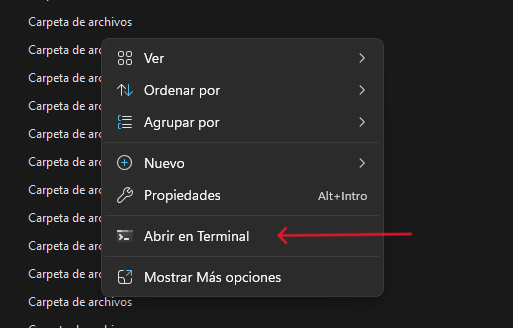
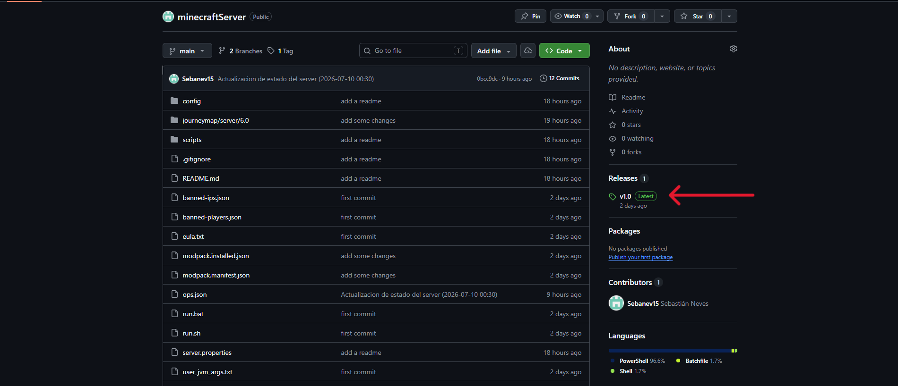
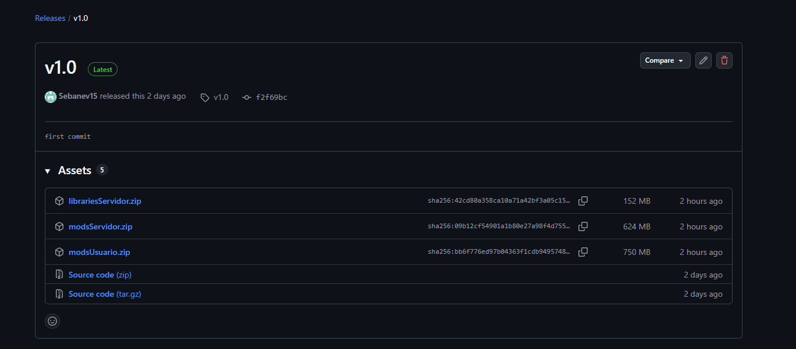
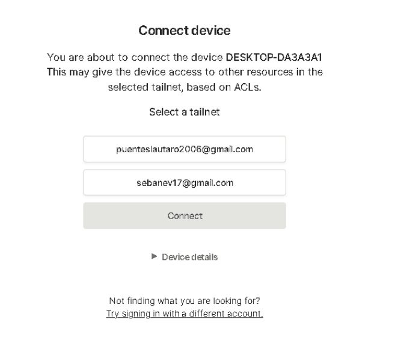

# Minecraft Server Final

Guía de instalación y uso del servidor distribuido. Cualquier integrante del grupo puede seguir estos pasos para convertirse en host, sin necesidad de una máquina encendida las 24 horas.

## Índice

- [Instalaciones necesarias](#instalaciones-necesarias)
  - [Repositorio](#repositorio)
  - [Configuración de rclone](#configuración-de-rclone)
  - [Tailscale](#tailscale)
- [Cómo levantar el servidor paso a paso](#cómo-levantar-el-servidor-paso-a-paso)
- [Cómo cerrar el servidor correctamente](#cómo-cerrar-el-servidor-correctamente)

---

## Instalaciones necesarias

### Repositorio

Lo primero que necesitamos es tener el repositorio de GitHub clonado.

1. Ingresá al directorio donde querés guardar los archivos del servidor.
2. Hacé clic derecho dentro del directorio y seleccioná **"Abrir en terminal"**.



3. Ejecutá el siguiente comando para clonar el repositorio:

```powershell
git clone https://github.com/Sebanev15/minecraftServer.git
```

Esto debería traer la estructura completa del repositorio. Una vez que confirmes que los archivos se descargaron correctamente, hay que descargar 3 archivos adicionales desde la sección de *Releases* del repositorio, a la que se accede haciendo clic en el enlace señalado en la siguiente imagen:




Dentro del Release vas a encontrar estos 3 archivos `.zip`, y **cada uno va en un lugar distinto**:




| Archivo | Dónde va | Para qué sirve |
|---|---|---|
| `modsServidor.zip` | Descomprimir dentro de la carpeta del repositorio clonado | Mods que corren en el servidor (lógica del mundo, generación de terreno, etc.) |
| `librariesServidor.zip` | Descomprimir dentro de la carpeta del repositorio clonado | Librerías que el servidor necesita para arrancar |
| `modsUsuario.zip` | Descomprimir dentro de la carpeta `mods` de **tu propio Minecraft** (`%appdata%\.minecraft\mods`, o la carpeta de mods de tu launcher) | Mods que solo hacen falta del lado del jugador: interfaz, efectos visuales, animaciones. **No van dentro de la carpeta del servidor.** |

> ℹ️ `modsUsuario.zip` es responsabilidad de cada jugador, no solo de quien hostea. Todos los que se van a conectar necesitan instalar estos mods en su propio cliente de Minecraft, ya sea que hosteen o no, para que el pack coincida con el del servidor.

Una vez descomprimidos `modsServidor.zip` y `librariesServidor.zip` dentro de la carpeta del repositorio (y `modsUsuario.zip` dentro de tu carpeta personal de mods), el servidor está casi listo. Lo siguiente es configurar **rclone** y **Tailscale**.

---

### Configuración de rclone

#### ¿Qué hace rclone en este flujo?

El servidor usa rclone para guardar y recuperar el mundo desde una carpeta compartida de Google Drive. Esa carpeta se llama `minecraft-server`, y dentro viven los archivos sincronizados entre hosts:

| Archivo | Función |
|---|---|
| `world.zip` | Backup del mundo, se sube y se baja entre máquinas |
| `host.lock` | Indica que una máquina está hosteando en ese momento. Si no hay ningún host activo, este archivo no existe |

#### Cómo dejarlo listo

La configuración de rclone tiene 4 partes bien diferenciadas: **instalar**, **crear el remote**, **conectar la carpeta compartida** y **verificar que todo funciona**. Segui los pasos en orden — si te salteás la parte de la carpeta compartida (la más fácil de olvidar), rclone se instala perfecto pero no va a poder ver ni subir el mundo.

##### Parte 1 — Instalar rclone

```powershell
winget install Rclone.Rclone
```

Cerrá la consola y abrí una nueva (necesario para que Windows actualice el PATH), y confirmá que responde:

```powershell
rclone version
```

> Si este comando falla, no sigas con la configuración hasta resolver la instalación.

##### Parte 2 — Crear el remote `mcworld`

```powershell
rclone config
```

Esto abre un asistente interactivo. Respondé así:

| Pregunta del asistente | Qué responder |
|---|---|
| Elegir acción | Crear un remote nuevo |
| Nombre del remote | `mcworld` (exacto, los scripts esperan este nombre) |
| Tipo de storage | `drive` (Google Drive) |
| `client_id` / `client_secret` | Dejar vacío, presionar Enter |
| Autenticación | Se abre el navegador (o te da un token por consola) — iniciá sesión con la cuenta de Google que van a usar como almacén. Si el navegador no se abre solo, seguí la [documentación oficial de rclone](https://rclone.org/drive/#making-your-own-client-id) |
| ¿Configurar como Shared Drive? | `n` (no, salvo que específicamente usen Google Workspace) |
| Opciones avanzadas | Aceptar los valores por defecto |
| Confirmar configuración | `y` (yes, this is OK) |

Al terminar, verificá que el remote quedó creado:

```powershell
rclone listremotes
```
La salida debe incluir `mcworld:`.

##### Parte 3 — Conectar la carpeta compartida a tu Drive

Esta parte es la que más se salta, y sin ella rclone no va a poder ver la carpeta `minecraft-server` aunque el remote esté bien configurado. Google Drive no muestra por defecto las carpetas "Compartidas conmigo" a herramientas externas como rclone — hay que agregarlas explícitamente a tu propia unidad:

1. Entrá a [drive.google.com](https://drive.google.com) con la misma cuenta que usaste en la Parte 2.
2. Ir a **"Compartido conmigo"** (panel izquierdo).
3. Clic derecho sobre la carpeta `minecraft-server`.
4. Elegir **"Organizar"** → **"Añadir acceso directo a Drive"** (en inglés: *"Organize"* → *"Add shortcut to Drive"*).
5. Elegir **"Mi unidad"** como destino → Confirmar.

##### Parte 4 — Verificar que todo funciona

```powershell
rclone lsd mcworld:
```
Tiene que aparecer `minecraft-server` en la lista. Si no aparece, volvé a la Parte 3 — es casi siempre eso.

```powershell
rclone ls mcworld:minecraft-server
```
Esto debería devolver un `world.zip`. Si no devuelve nada, el remote está bien conectado pero por algún motivo no ve el contenido — revisá los permisos que te dieron sobre la carpeta (tenés que tener rol de **Editor**, no solo "puede ver").

Como última prueba, confirmá que también podés **escribir** en la carpeta (no solo leer), creando y subiendo un archivo de prueba:
```powershell
Set-Content .\rclone-test.txt "prueba"
rclone copy .\rclone-test.txt mcworld:minecraft-server\ --progress
rclone cat mcworld:minecraft-server\rclone-test.txt
Remove-Item .\rclone-test.txt
rclone delete mcworld:minecraft-server\rclone-test.txt
```
Si los 4 comandos corren sin error, rclone está listo.

---

### Tailscale

Para poder avanzar con Tailscale, tenés que haber recibido un link de invitación individual para acceder a la red privada. Si todavía no lo tenés, pedímelo y avisame cuando lo hayas abierto.

Una vez que confirme que estás dentro de la red, tenés que desloguearte de Tailscale desde tu dispositivo:

```powershell
tailscale logout
```

Y luego volver a iniciar sesión:

```powershell
tailscale login
```

Esto debería abrir el navegador y pedirte que inicies sesión nuevamente con tu cuenta. Te va a aparecer una pantalla similar a esta:



Ahí tenés que seleccionar la opción **`sebanev17@gmail.com`**. Una vez hecho esto, ya deberías estar conectado a la red y listo para levantar el servidor.

---

## Cómo levantar el servidor paso a paso

### Paso 1: abrir una consola en la carpeta `scripts`

La persona que va a hostear debe abrir PowerShell dentro de la carpeta `scripts` del servidor.

### Paso 2: iniciar el menú

Ejecutá:

```powershell
.\ServerManager.ps1
```

Cuando veas un menú parecido a este, significa que `ServerManager.ps1` se ejecutó correctamente:

```text
=================================
 Minecraft Server Manager
=================================
1) Iniciar servidor
2) Finalizar servidor
3) Actualizar (solo sincronizar sin jugar)
4) Estado del servidor
5) Salir
=================================
```

### Cómo levantar el servidor

Elegí la opción **1**. El script va a hacer una serie de comprobaciones y, al finalizar, va a abrir una terminal aparte — esto es normal, significa que el servidor está arrancando.

---

## Cómo cerrar el servidor correctamente

Al terminar de jugar, la persona que está hosteando **debe** usar la opción **2 (Finalizar servidor)** del menú. Este paso sube todos los cambios y deja todo listo para el próximo host.

> ⚠️ Si no cerrás el servidor con esta opción, el próximo host no va a tener los últimos cambios sincronizados.